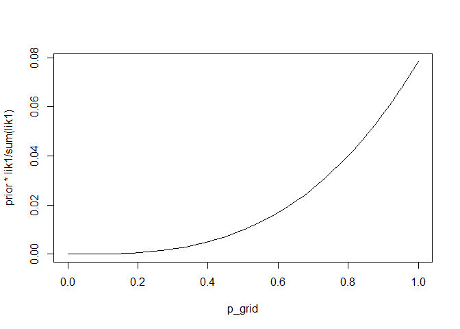
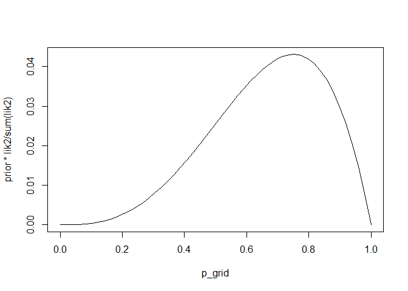
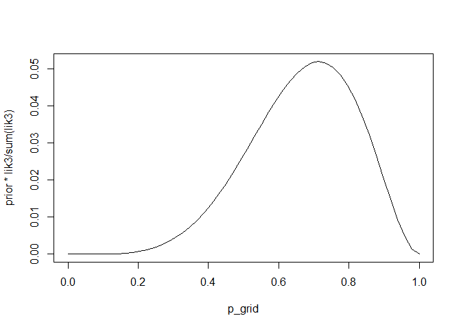
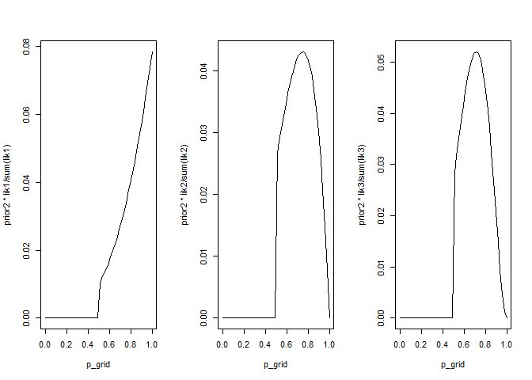

Statistical Rethinking - Ch2
================
Nick Lowery
July 27, 2018

Easy
====

2E1
---

1.  Pr(rain, Monday) / Pr(Monday)

2E2
---

1.  Probability that it's Monday, given that it's raining

2E3
---

1.  Pr(Monday | rain), and also
2.  Pr(rain | Monday) \* Pr(Monday) / Pr(rain), from Bayes' Rule

2E4
---

Given our limited knowledge of the deterministic physics involved in tossing the globe, we expect the result of each toss to be effectively random, and therefore that 'water' will result 70% of the time.

Medium
======

2M1
---

General setup for grid search with flat priors:

``` r
grid_length <- 50
p_grid <- seq(0, 1, length.out = grid_length)
prior <- rep(1, grid_length)
```

1: WWW

``` r
lik1 <- dbinom(3, size = 3, prob = p_grid)
plot(p_grid, prior * lik1 / sum(lik1), type = "l")
```



2: WWWL

``` r
lik2 <- dbinom(3, size = 4, prob = p_grid)
plot(p_grid, prior * lik2 / sum(lik2), type = "l")
```



3: LWWLWWW

``` r
lik3 <- dbinom(5, size = 7, prob = p_grid)
plot(p_grid, prior * lik3 / sum(lik3), type = "l")
```



2M2
---

``` r
prior2 <- c(rep(0, grid_length/2), rep(1, grid_length/2))

par(mfrow = c(1,3))
plot(p_grid, prior2 * lik1 / sum(lik1), type = "l")
plot(p_grid, prior2 * lik2 / sum(lik2), type = "l")
plot(p_grid, prior2 * lik3 / sum(lik3), type = "l")
```



2M3
---

Pr(Earth|land) = Pr(land|Earth) \* Pr(Earth) / Pr(land). Assign these probabilities:

``` r
pr.earth <- 0.5
pr.mars <- 0.5
pr.land.earth <- 0.3
pr.land.mars <- 1
```

And use Bayes' Theorem to calculate the probability of Earth given the 'land' result:

``` r
pr.land.earth * pr.earth / mean(c(pr.land.earth, pr.land.mars))
```

    ## [1] 0.2307692

2M4
---

cards: bb, bw, ww  
obs: b?  

ways to give b?:  
bb 2  
bw 1  
ww 0  

ways(bb) / sum(ways) = 2/3

2M5
---

cards: bb, bw, ww, bb  
obs: b?  

ways to give b?  
bb 4  
bw 1  
ww 0  

ways(bb) / sum(ways) = 4/5

2M6
---

cards: bb, bw, ww  
obs: b?  

ways to give b?  
bb 2  
bw 1x2     
ww 0x3     

ways(bb) / sum(ways) = 2/4 = 0.5

2M7
---

cards: bb, bw, ww  
obs: b?, w?  

ways to give b? w?  
bb bw 2  
bb ww 4  
bw bb 0  
bw ww 2  
ww bw 0  
ww bb 0  

ways(bb | b?, w?) / sum(ways) = 6/8 = 0.75

Hard
====

2H1
---

``` r
pr.a <- 0.5
pr.b <- 0.5
pr.twins.a <- 0.1
pr.twins.b <- 0.2

pr.twins <- pr.twins.a * pr.a + pr.twins.b * pr.b  # 0.15
pr.a.twins <- pr.twins.a * pr.a / pr.twins # 1/3 
pr.b.twins <- pr.twins.b * pr.a / pr.twins # 2/3
```

So, the after observing twins, it's twice as likely that we have species B, which makes sense. Putting it all together, the probability of twins, given an observation of twins and unknown species identification:

``` r
pr.twins * (pr.b.twins * pr.twins.b + pr.a.twins * pr.twins.a)
```

    ## [1] 0.025

Note this is higher than naive expectation of intependent events: Pr(twins)^2 = 0.15^2 = 0.0225 &lt; 0.025 i.e. observation of twins makes mother more likely to be B, a la Bayesian updating.

2H2
---

``` r
pr.a.twins # see 2H1
```

    ## [1] 0.3333333

2H3
---

``` r
likA <- pr.twins.a * (1 - pr.twins.a)
likB <- pr.twins.b * (1 - pr.twins.b)
prior.2h3 <- c(1,2) # see 2H1

posterior.2h3 <- c(likA, likB) * prior.2h3 / sum(c(likA, likB))
posterior.2h3[1]
```

    ## [1] 0.36

2H4
---

Genetic test only:

``` r
lik.test <- c(0.8, 1-0.65)
prior.test <- c(1,1)

posterior.test <- lik.test*prior.test/sum(lik.test)
names(posterior.test) <- c("Species A", "Species B")
posterior.test
```

    ## Species A Species B 
    ## 0.6956522 0.3043478

Accounting for births:

``` r
prior.births <- posterior.2h3

posterior.births <- lik.test*prior.births/sum(lik.test*prior.births)
names(posterior.births) <- c("Species A", "Species B")
posterior.births
```

    ## Species A Species B 
    ## 0.3913043 0.6086957
